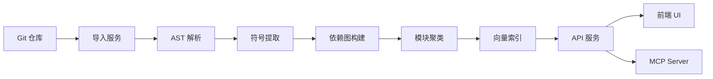
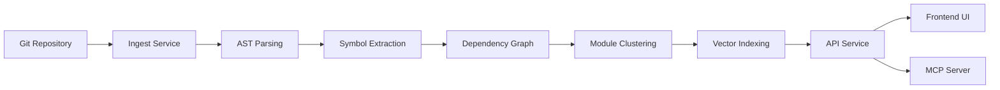

# Codebase Analyzer

> **中文** | [English](#english-version)

<p align="center">
  
  
  
  
</p>

一个帮助开发者**学习和理解 Git 开源项目**的智能工具，同时为 AI 代码开发提供高质量的 **Codebase 上下文**。

---

## 📋 目录

- [核心目标](#-核心目标)
- [功能特性](#-功能特性)
- [技术栈](#-技术栈)
- [项目架构](#-项目架构)
- [项目结构](#-项目结构)
- [快速开始](#-快速开始)
- [配置说明](#-配置说明)
- [API 文档](#-api-文档)
- [前端使用指南](#-前端使用指南)
- [MCP Server 集成](#-mcp-server-集成)
- [开发指南](#-开发指南)
- [测试](#-测试)
- [部署](#-部署)
- [贡献指南](#-贡献指南)
- [路线图](#-路线图)
- [常见问题](#-常见问题)
- [许可证](#-许可证)

---

## 🎯 核心目标

1. **辅助学习开源项目** - 自动分析代码结构、生成学习路径、提供智能问答
2. **提供 Codebase 上下文** - 为 Cursor/Copilot 等 AI IDE 导出结构化代码上下文
3. **MCP Server 生成** - 一键生成可供 AI 调用的 MCP 服务，让 AI 直接查询代码库

---

## ✨ 功能特性

### 代码分析

| 功能 | 描述 |
|------|------|
| 🔍 **仓库导入** | 支持 Git URL 和本地路径导入 |
| 🐍 **多语言解析** | 基于 tree-sitter 支持 Python、Java、TypeScript、Go、Rust 等 20+ 语言 |
| 📊 **依赖图谱** | 文件级和符号级依赖关系可视化 |
| 📦 **模块聚类** | 智能模块划分和层级结构识别 |
| 🔗 **符号导航** | 跳转到定义、查找引用 |

### 学习辅助

| 功能 | 描述 |
|------|------|
| 📖 **代码浏览器** | 在线查看源码、语法高亮、符号大纲 |
| 🎯 **入口点发现** | 自动识别项目入口文件 |
| 📚 **学习路径** | 推荐阅读顺序、难度分级 |
| 📝 **AI 文档** | 自动生成项目概述和模块文档 |

### AI 能力

| 功能 | 描述 |
|------|------|
| 💬 **智能问答** | 基于代码上下文的 Q&A，支持引用定位 |
| 🔎 **语义搜索** | FAISS 向量检索，理解代码语义 |
| 📄 **上下文导出** | 为 AI IDE 生成结构化代码上下文 |

### MCP Server 生成 🔥

| 功能 | 描述 |
|------|------|
| 🔌 **自动生成** | 一键生成可供 AI 调用的 MCP Server |
| 🎯 **Cursor 集成** | 直接在 Cursor 中使用代码库工具 |
| 🤖 **Claude Desktop** | Claude 可直接查询代码库 |
| 🛠️ **丰富工具集** | 语义搜索、代码浏览、符号导航等 |

### 用户系统

| 功能 | 描述 |
|------|------|
| 👤 **用户认证** | 注册、登录、JWT 认证 |
| 📁 **项目管理** | 我的项目、公共项目列表 |
| 🔐 **权限控制** | 管理员后台、用户权限管理 |

---

## 🛠️ 技术栈

### 后端 (Backend)

| 技术 | 用途 |
|------|------|
| **Python 3.12+** | 主要开发语言 |
| **FastAPI** | Web 框架，异步支持 |
| **Uvicorn** | ASGI 服务器 |
| **tree-sitter** | 多语言 AST 解析 |
| **NetworkX** | 依赖图构建与分析 |
| **FAISS** | 向量相似度搜索 |
| **SQLite** | 数据持久化 |
| **Pydantic v2** | 数据验证与序列化 |
| **GitPython** | Git 仓库操作 |
| **PyJWT** | JWT 认证 |

### 前端 (Frontend)

| 技术 | 用途 |
|------|------|
| **Vue 3.5+** | 前端框架 |
| **TypeScript** | 类型安全 |
| **Vite** | 构建工具 |
| **Pinia** | 状态管理 |
| **Vue Router** | 路由管理 |
| **Naive UI** | UI 组件库 |
| **Tailwind CSS** | 样式框架 |
| **Axios** | HTTP 客户端 |
| **Marked** | Markdown 渲染 |
| **Mermaid** | 图表渲染 |

---

## 🏗️ 项目架构

```
┌─────────────────────────────────────────────────────────────────┐
│                        Frontend (Vue 3)                          │
│  ┌──────────┐  ┌──────────┐  ┌──────────┐  ┌──────────────────┐ │
│  │ WikiView │  │CodeBrowse│  │MCPGenerat│  │  ContextExporter │ │
│  └────┬─────┘  └────┬─────┘  └────┬─────┘  └────────┬─────────┘ │
└───────┼─────────────┼─────────────┼─────────────────┼───────────┘
        │             │             │                 │
        ▼             ▼             ▼                 ▼
┌─────────────────────────────────────────────────────────────────┐
│                     FastAPI Backend                              │
│  ┌──────────────────────────────────────────────────────────┐   │
│  │                    API Routes Layer                       │   │
│  │  /repos  /jobs  /files  /symbols  /search  /mcp  /auth   │   │
│  └──────────────────────────────────────────────────────────┘   │
│                              │                                   │
│  ┌──────────────────────────────────────────────────────────┐   │
│  │                   Services Layer                          │   │
│  │ ┌─────────┐ ┌──────────┐ ┌───────────┐ ┌──────────────┐  │   │
│  │ │ Ingest  │ │ Analysis │ │CodeBrowser│ │ MCPGenerator │  │   │
│  │ └─────────┘ └──────────┘ └───────────┘ └──────────────┘  │   │
│  │ ┌─────────┐ ┌──────────┐ ┌───────────┐ ┌──────────────┐  │   │
│  │ │ Search  │ │ AI Docs  │ │LearningPth│ │CodebaseExport│  │   │
│  │ └─────────┘ └──────────┘ └───────────┘ └──────────────┘  │   │
│  └──────────────────────────────────────────────────────────┘   │
│                              │                                   │
│  ┌──────────────────────────────────────────────────────────┐   │
│  │                    Core Layer                             │   │
│  │  ┌──────────┐  ┌──────────┐  ┌──────────┐  ┌──────────┐  │   │
│  │  │ Parsers  │  │   DB     │  │  FAISS   │  │   Jobs   │  │   │
│  │  │(tree-sit)│  │ (SQLite) │  │  Index   │  │  Queue   │  │   │
│  │  └──────────┘  └──────────┘  └──────────┘  └──────────┘  │   │
│  └──────────────────────────────────────────────────────────┘   │
└─────────────────────────────────────────────────────────────────┘
```

### 核心流程



---

## 📁 项目结构

```
codebase/
├── backend/                          # FastAPI 后端服务
│   ├── app/
│   │   ├── api/
│   │   │   ├── routes.py             # 核心 API 路由
│   │   │   └── auth_routes.py        # 认证相关路由
│   │   ├── core/
│   │   │   ├── settings.py           # 应用配置
│   │   │   ├── logging.py            # 日志配置
│   │   │   └── jobs.py               # 任务队列
│   │   ├── models/
│   │   │   └── schemas.py            # Pydantic 数据模型
│   │   ├── services/
│   │   │   ├── parsers/              # 多语言解析器
│   │   │   │   ├── base.py           # 解析器基类
│   │   │   │   ├── python_parser.py  # Python 解析器
│   │   │   │   └── java_parser.py    # Java 解析器
│   │   │   ├── ingest.py             # 仓库导入服务
│   │   │   ├── analysis.py           # 代码分析服务
│   │   │   ├── code_browser.py       # 代码浏览服务
│   │   │   ├── symbol_navigator.py   # 符号导航服务
│   │   │   ├── dependency_graph.py   # 依赖图构建
│   │   │   ├── module_tree.py        # 模块树生成
│   │   │   ├── faiss_index.py        # FAISS 向量索引
│   │   │   ├── embeddings.py         # 向量嵌入服务
│   │   │   ├── learning_path.py      # 学习路径生成
│   │   │   ├── codebase_export.py    # 代码上下文导出
│   │   │   ├── mcp_generator.py      # MCP Server 生成器
│   │   │   ├── mcp_runtime.py        # MCP 运行时
│   │   │   ├── ai_docs.py            # AI 文档生成
│   │   │   ├── llm_client.py         # LLM 客户端
│   │   │   ├── auth.py               # 用户认证服务
│   │   │   ├── db.py                 # 数据库操作
│   │   │   └── jobs_db.py            # 任务数据库
│   │   └── main.py                   # FastAPI 应用入口
│   ├── db/
│   │   ├── schema.sql                # PostgreSQL Schema
│   │   ├── schema_sqlite.sql         # SQLite Schema
│   │   └── schema_sqlite_jobs.sql    # Jobs 表 Schema
│   ├── workspace/                    # 运行时工作目录
│   │   ├── indexes/                  # FAISS 索引文件
│   │   ├── codewiki_docs/            # 生成的文档
│   │   └── mcp/                      # MCP Server 文件
│   ├── tests/                        # 测试用例
│   └── requirements.txt              # Python 依赖
│
├── frontend-vue/                     # Vue 3 前端
│   ├── src/
│   │   ├── components/
│   │   │   ├── CodeBrowser.vue       # 代码浏览器组件
│   │   │   ├── MCPGenerator.vue      # MCP 生成器组件
│   │   │   ├── ContextExporter.vue   # 上下文导出组件
│   │   │   └── FileTreeNode.vue      # 文件树节点
│   │   ├── views/
│   │   │   ├── WikiDetailView.vue    # Wiki 详情页
│   │   │   ├── ProjectListView.vue   # 项目列表
│   │   │   ├── MyProjectsView.vue    # 我的项目
│   │   │   ├── NewProjectView.vue    # 新建项目
│   │   │   ├── LoginView.vue         # 登录页
│   │   │   ├── RegisterView.vue      # 注册页
│   │   │   └── AdminView.vue         # 管理后台
│   │   ├── stores/
│   │   │   ├── wiki.ts               # Wiki 状态管理
│   │   │   └── auth.ts               # 认证状态管理
│   │   ├── services/
│   │   │   └── api.ts                # API 服务
│   │   ├── router/
│   │   │   └── index.ts              # 路由配置
│   │   ├── App.vue                   # 根组件
│   │   └── main.ts                   # 入口文件
│   ├── package.json
│   └── vite.config.ts
│
├── CodeWiki/                         # CodeWiki 集成模块
├── deploy.ps1                        # Windows 部署脚本
├── deploy.sh                         # Linux/macOS 部署脚本
├── BACKEND_API_SPEC.md               # API 规范文档
├── DEV_BACKEND_PLAN.md               # 后端开发计划
├── OPTIMIZATION_PLAN.md              # 优化计划
└── README.md                         # 本文件
```

---

## 🚀 快速开始

### 环境要求

- **Python**: 3.12+
- **Node.js**: 18+
- **Git**: 2.30+

### 方式一：一键部署（推荐）

#### Windows

```powershell
# 克隆项目
git clone https://github.com/your-repo/codebase.git
cd codebase

# 一键启动
./deploy.ps1
```

#### macOS / Linux

```bash
# 克隆项目
git clone https://github.com/your-repo/codebase.git
cd codebase

# 添加执行权限
chmod +x deploy.sh

# 一键启动
./deploy.sh
```

访问 `http://localhost:8000` 即可使用。

### 方式二：手动运行

#### 后端

```bash
# 进入后端目录
cd backend

# 创建虚拟环境
python -m venv .venv

# 激活虚拟环境
# Windows:
.venv\Scripts\activate
# macOS/Linux:
source .venv/bin/activate

# 安装依赖
pip install -r requirements.txt

# 启动服务
uvicorn app.main:app --reload --host 0.0.0.0 --port 8000
```

#### 前端

```bash
# 进入前端目录
cd frontend-vue

# 安装依赖
npm install

# 启动开发服务器
npm run dev
```

前端默认运行在 `http://localhost:5173`，在 UI 中设置 **API Base URL** 为 `http://localhost:8000`。

### 方式三：Docker 部署

```bash
# 构建镜像
docker build -t codebase-analyzer .

# 运行容器
docker run -d -p 8000:8000 -v $(pwd)/workspace:/app/workspace codebase-analyzer
```

---

## ⚙️ 配置说明

### 环境变量

创建 `.env` 文件或设置环境变量：

```bash
# ===== LLM 配置 (问答/AI文档必需) =====
LLM_BASE_URL=https://api.openai.com/v1
LLM_API_KEY=your-api-key
LLM_MODEL_NAME=gpt-4o-mini
LLM_TIMEOUT=60
LLM_MAX_TOKENS=4096

# ===== Embedding 配置 (推荐配置，提升搜索质量) =====
EMBEDDING_BASE_URL=https://api.openai.com/v1
EMBEDDING_API_KEY=your-api-key
EMBEDDING_MODEL=text-embedding-3-small

# ===== CodeWiki 集成 =====
CODEWIKI_ENABLED=0  # 0: 使用内置分析器, 1: 启用 CodeWiki

# ===== 数据库配置 =====
DATABASE_URL=sqlite:///./workspace/analysis.db

# ===== 认证配置 =====
JWT_SECRET_KEY=your-secret-key
JWT_ALGORITHM=HS256
JWT_EXPIRE_HOURS=24

# ===== 管理员配置 =====
ADMIN_USERNAME=admin
ADMIN_PASSWORD=admin123
ADMIN_EMAIL=admin@example.com
```

### LLM 配置说明

本项目支持 OpenAI 兼容的 API，包括但不限于：

| 提供商 | base_url 示例 |
|--------|--------------|
| OpenAI | `https://api.openai.com/v1` |
| Azure OpenAI | `https://your-resource.openai.azure.com` |
| Ollama (本地) | `http://localhost:11434/v1` |
| vLLM | `http://localhost:8000/v1` |
| DeepSeek | `https://api.deepseek.com` |

### Embedding 配置说明

如未配置 Embedding，系统将使用基于 hash 的向量（质量较低但可用）。建议配置真实的 Embedding 模型以获得更好的语义搜索效果。

---

## 📚 API 文档

完整 API 文档请访问 `http://localhost:8000/docs` (Swagger UI) 或 `http://localhost:8000/redoc` (ReDoc)。

### 健康检查

```http
GET /health
```

**响应示例**:
```json
{
  "status": "ok"
}
```

### 仓库管理

#### 导入仓库

```http
POST /repos/ingest
Content-Type: application/json

{
  "url": "https://github.com/user/repo.git",
  "branch": "main",
  "include": ["*.py", "*.java"],
  "exclude": ["tests/*", "docs/*"]
}
```

**响应**:
```json
{
  "repo_id": "abc123",
  "job_id": "job456"
}
```

#### 查询任务状态

```http
GET /jobs/{job_id}
```

**响应**:
```json
{
  "status": "completed",
  "progress": 100,
  "result": { "repo_id": "abc123" }
}
```

#### 获取仓库摘要

```http
GET /repos/{repo_id}/summary
```

**响应**:
```json
{
  "repo_id": "abc123",
  "name": "my-project",
  "languages": ["Python", "Java"],
  "file_count": 150,
  "module_count": 12,
  "entry_points": [...]
}
```

### 代码浏览

#### 获取文件树

```http
GET /repos/{repo_id}/files
```

#### 获取文件内容

```http
GET /repos/{repo_id}/files/{path}
```

#### 获取文件大纲

```http
GET /repos/{repo_id}/outline/{path}
```

### 符号导航

#### 搜索符号

```http
GET /repos/{repo_id}/symbols?query=MyClass&kind=class
```

#### 获取符号详情

```http
GET /repos/{repo_id}/symbols/{symbol_id}
```

#### 获取符号引用

```http
GET /repos/{repo_id}/symbols/{symbol_id}/references
```

#### 获取符号定义

```http
GET /repos/{repo_id}/symbols/{symbol_id}/definition
```

### 搜索与问答

#### 语义搜索

```http
POST /repos/{repo_id}/search
Content-Type: application/json

{
  "query": "如何处理用户认证",
  "top_k": 10,
  "module_scope": ["auth"]
}
```

#### 智能问答

```http
POST /repos/{repo_id}/answer
Content-Type: application/json

{
  "query": "这个项目的入口点在哪里？",
  "max_evidence": 5,
  "model": {
    "base_url": "https://api.openai.com/v1",
    "api_key": "your-key",
    "model_name": "gpt-4o-mini"
  }
}
```

**响应**:
```json
{
  "answer": "项目的入口点位于 src/main.py...",
  "citations": [
    {
      "file_path": "src/main.py",
      "line_start": 10,
      "line_end": 25,
      "symbol": "main"
    }
  ]
}
```

### 学习路径

#### 获取学习路径

```http
GET /repos/{repo_id}/learning-path
```

**响应**:
```json
{
  "recommended_order": [...],
  "entry_points": [...],
  "difficulty_levels": {
    "beginner": [...],
    "intermediate": [...],
    "advanced": [...]
  }
}
```

#### 获取入口点

```http
GET /repos/{repo_id}/entry-points
```

### Codebase 导出

#### 导出代码上下文

```http
POST /repos/{repo_id}/codebase/export
Content-Type: application/json

{
  "format": "cursor",
  "scope": "module",
  "module_ids": ["auth", "api"],
  "include_deps": true,
  "max_tokens": 50000
}
```

#### 智能上下文生成

```http
POST /repos/{repo_id}/codebase/context
Content-Type: application/json

{
  "query": "用户认证相关代码",
  "max_tokens": 20000
}
```

### MCP Server

#### 获取 MCP 工具列表

```http
GET /repos/{repo_id}/mcp/tools
```

#### 获取 MCP Server 代码

```http
GET /repos/{repo_id}/mcp/server-code
```

#### 获取 Cursor 配置

```http
GET /repos/{repo_id}/mcp/cursor-config
```

#### 获取 Claude 配置

```http
GET /repos/{repo_id}/mcp/claude-config
```

#### 生成并保存 MCP Server

```http
POST /repos/{repo_id}/mcp/generate
```

### 认证相关

#### 用户注册

```http
POST /auth/register
Content-Type: application/json

{
  "username": "user1",
  "email": "user1@example.com",
  "password": "password123"
}
```

#### 用户登录

```http
POST /auth/login
Content-Type: application/json

{
  "username": "user1",
  "password": "password123"
}
```

**响应**:
```json
{
  "access_token": "eyJ...",
  "token_type": "bearer"
}
```

---

## 🖥️ 前端使用指南

### 1. 导入仓库

1. 进入首页或"新建项目"页面
2. 输入 Git 仓库 URL（如 `https://github.com/user/repo.git`）或本地路径
3. 可选：设置分支、包含/排除规则
4. 点击"开始分析"

### 2. 浏览分析结果

分析完成后进入 Wiki 详情页，包含以下标签页：

| 标签页 | 功能 |
|--------|------|
| **概览** | 项目摘要、架构图、技术栈 |
| **模块** | 模块列表、模块详情、依赖关系 |
| **代码** | 文件树、源码浏览、符号大纲 |
| **搜索** | 语义搜索、关键词搜索 |
| **问答** | AI 智能问答 |
| **学习** | 学习路径、入口点、推荐顺序 |
| **导出** | Codebase 上下文导出 |
| **MCP** | MCP Server 生成与配置 |

### 3. 代码浏览

- **文件树**: 左侧显示项目文件结构
- **源码**: 右侧显示文件内容，支持语法高亮
- **大纲**: 右上角显示当前文件的符号列表
- **跳转**: 点击符号跳转到定义

### 4. 智能问答

1. 切换到"问答"标签页
2. 输入问题（如"这个项目的入口点在哪里？"）
3. 配置 LLM（如已全局配置可跳过）
4. 点击"提问"
5. 查看回答及引用定位

### 5. 导出 Codebase 上下文

1. 切换到"导出"标签页
2. 选择导出格式（Cursor / Copilot / Markdown / JSON）
3. 选择导出范围（全部 / 模块 / 文件）
4. 设置 Token 限制
5. 点击"导出"

### 6. 生成 MCP Server

1. 切换到"MCP"标签页
2. 查看可用工具列表
3. 点击"生成 MCP Server"
4. 下载配置文件，添加到 Cursor/Claude

---

## 🔌 MCP Server 集成

### 什么是 MCP Server？

MCP (Model Context Protocol) 是一种让 AI 模型访问外部工具的协议。本项目可以为每个分析过的仓库生成一个 MCP Server，让 AI 可以：

- 搜索代码库
- 浏览文件内容
- 获取符号定义
- 查询项目结构
- 获取学习路径

### 生成 MCP Server

```bash
# 通过 API 生成
curl -X POST http://localhost:8000/repos/{repo_id}/mcp/generate
```

### 配置 Cursor

1. 在前端"MCP"标签页点击"获取 Cursor 配置"
2. 下载 `cursor_config.json`
3. 将配置添加到 Cursor 的 MCP 设置中

配置示例：
```json
{
  "mcpServers": {
    "codebase-repo_abc123": {
      "command": "python",
      "args": ["/path/to/mcp_server_repo_abc123.py"],
      "env": {}
    }
  }
}
```

### 配置 Claude Desktop

1. 在前端"MCP"标签页点击"获取 Claude 配置"
2. 下载 `claude_config.json`
3. 将配置添加到 Claude Desktop 的配置文件

### 可用工具

| 工具 | 描述 |
|------|------|
| `search_code` | 语义搜索代码 |
| `get_file_content` | 获取文件内容 |
| `get_file_chunk` | 分块获取文件内容 |
| `get_file_tree` | 获取项目文件结构 |
| `search_in_file` | 在文件中搜索 |
| `search_symbols` | 搜索符号（类/函数/方法） |
| `get_project_summary` | 获取项目概要 |
| `get_modules` | 获取模块列表 |
| `get_file_outline` | 获取文件符号大纲 |
| `get_entry_points` | 获取项目入口点 |
| `get_learning_path` | 获取学习路径 |

---

## 💻 开发指南

### 本地开发设置

```bash
# 克隆项目
git clone https://github.com/your-repo/codebase.git
cd codebase

# 后端开发
cd backend
python -m venv .venv
source .venv/bin/activate  # Windows: .venv\Scripts\activate
pip install -r requirements.txt
pip install -e .  # 开发模式安装

# 前端开发
cd ../frontend-vue
npm install
```

### 代码规范

#### Python (后端)

- 使用 `ruff` 进行代码检查和格式化
- 类型注解：使用 Python 3.10+ 类型语法
- 文档字符串：Google 风格
- 测试：pytest

```bash
# 格式化
ruff format .

# 检查
ruff check .

# 类型检查
mypy app/
```

#### TypeScript (前端)

- 使用 ESLint + Prettier
- 组件：Vue 3 Composition API + `<script setup>`
- 状态管理：Pinia

```bash
# 格式化
npm run format

# 检查
npm run lint
```

### 添加新的语言解析器

1. 在 `backend/app/services/parsers/` 创建新解析器：

```python
# new_language_parser.py
from .base import BaseParser

class NewLanguageParser(BaseParser):
    LANGUAGE = "new_language"
    
    def extract_symbols(self, tree, source_code: bytes) -> list:
        # 实现符号提取逻辑
        pass
    
    def extract_imports(self, tree, source_code: bytes) -> list:
        # 实现导入提取逻辑
        pass
```

2. 在 `backend/app/services/parsers/__init__.py` 注册：

```python
from .new_language_parser import NewLanguageParser

PARSERS = {
    # ...
    "new_language": NewLanguageParser,
}
```

3. 确保已安装对应的 tree-sitter 语法包。

### 添加新的 API 端点

1. 在 `backend/app/api/routes.py` 添加路由：

```python
@router.get("/repos/{repo_id}/new-endpoint")
async def new_endpoint(repo_id: str):
    # 实现逻辑
    return {"data": "..."}
```

2. 如需复杂业务逻辑，在 `backend/app/services/` 创建新服务。

---

## 🧪 测试

### 运行后端测试

```bash
cd backend

# 运行所有测试
pytest

# 运行特定测试
pytest tests/test_python_parser.py

# 带覆盖率
pytest --cov=app --cov-report=html

# 查看覆盖率报告
open htmlcov/index.html
```

### 运行前端测试

```bash
cd frontend-vue

# 运行测试
npm run test

# 带覆盖率
npm run test:coverage
```

### 测试结构

```
backend/tests/
├── conftest.py              # 测试配置和 fixtures
├── fixtures/                # 测试数据
├── test_smoke.py            # 冒烟测试
├── test_python_parser.py    # Python 解析器测试
├── test_java_parser.py      # Java 解析器测试
└── test_integration_analysis.py  # 集成测试
```

---

## 📦 部署

### 生产环境部署

#### 使用 Gunicorn + Nginx

```bash
# 安装 Gunicorn
pip install gunicorn

# 启动
gunicorn app.main:app -w 4 -k uvicorn.workers.UvicornWorker -b 0.0.0.0:8000
```

Nginx 配置：

```nginx
server {
    listen 80;
    server_name your-domain.com;

    location / {
        proxy_pass http://127.0.0.1:8000;
        proxy_set_header Host $host;
        proxy_set_header X-Real-IP $remote_addr;
    }

    location /static {
        alias /path/to/frontend-vue/dist;
    }
}
```

#### Docker Compose

```yaml
version: '3.8'
services:
  backend:
    build: ./backend
    ports:
      - "8000:8000"
    volumes:
      - ./workspace:/app/workspace
    environment:
      - LLM_BASE_URL=https://api.openai.com/v1
      - LLM_API_KEY=${LLM_API_KEY}
    
  frontend:
    build: ./frontend-vue
    ports:
      - "80:80"
    depends_on:
      - backend
```

### 构建前端

```bash
cd frontend-vue
npm run build

# 输出在 dist/ 目录
```

---

## 🤝 贡献指南

我们欢迎各种形式的贡献！

### 贡献流程

1. **Fork** 本仓库
2. **创建分支**: `git checkout -b feature/your-feature`
3. **提交更改**: `git commit -m 'Add some feature'`
4. **推送分支**: `git push origin feature/your-feature`
5. **提交 PR**: 创建 Pull Request

### 提交规范

使用 Conventional Commits 格式：

```
feat: 添加新功能
fix: 修复 bug
docs: 文档更新
style: 代码格式（不影响功能）
refactor: 重构代码
test: 添加测试
chore: 构建/工具链变更
```

### 报告问题

请使用 GitHub Issues 报告问题，包含以下信息：

- 环境信息（OS、Python 版本、Node 版本）
- 复现步骤
- 期望行为
- 实际行为
- 错误日志

---

## 🗺️ 路线图

详见 [OPTIMIZATION_PLAN.md](./OPTIMIZATION_PLAN.md)

### 近期计划

- [ ] 对话历史记忆
- [ ] 混合搜索（语义 + 关键词）
- [ ] 更多语言支持
- [ ] 性能优化

### 长期计划

- [ ] 团队协作功能
- [ ] 代码审查集成
- [ ] CI/CD 集成
- [ ] 插件系统

---

## ❓ 常见问题

### Q: 分析大型仓库时很慢怎么办？

A: 可以通过以下方式优化：
1. 使用 `include`/`exclude` 过滤不需要的文件
2. 选择特定分支或 commit
3. 增加服务器配置

### Q: 未配置 Embedding 时搜索效果不好？

A: 未配置 Embedding 时系统使用 hash 向量，建议配置真实的 Embedding 模型（如 OpenAI 的 text-embedding-3-small）。

### Q: MCP Server 如何与 Cursor 集成？

A: 
1. 生成 MCP Server（通过 API 或前端）
2. 下载 Cursor 配置文件
3. 将配置添加到 Cursor 的 MCP 设置中
4. 重启 Cursor

### Q: 支持哪些编程语言？

A: 目前支持：Python、Java、TypeScript、JavaScript、Go、Rust、C、C++、C#、Ruby、PHP、Kotlin、Swift、HTML、CSS、JSON、YAML、TOML、Bash、Lua、SQL。

### Q: 如何自定义 LLM 模型？

A: 支持任何 OpenAI 兼容的 API。在环境变量或 API 请求中配置 `base_url`、`api_key` 和 `model_name`。

---

## 📄 许可证

本项目采用 [MIT License](./LICENSE)。

---

---

<a id="english-version"></a>

# Codebase Analyzer

> [中文](#codebase-analyzer) | **English**

<p align="center">
  
  
  
  
</p>

An intelligent tool to help developers **learn and understand Git open-source projects**, while providing high-quality **Codebase context** for AI code development.

---

## 📋 Table of Contents

- [Core Goals](#-core-goals)
- [Features](#-features)
- [Tech Stack](#-tech-stack)
- [Architecture](#-architecture)
- [Project Structure](#-project-structure)
- [Quick Start](#-quick-start)
- [Configuration](#-configuration)
- [API Documentation](#-api-documentation)
- [Frontend Usage Guide](#-frontend-usage-guide)
- [MCP Server Integration](#-mcp-server-integration)
- [Development Guide](#-development-guide)
- [Testing](#-testing)
- [Deployment](#-deployment)
- [Contributing](#-contributing)
- [Roadmap](#-roadmap)
- [FAQ](#-faq)
- [License](#-license)

---

## 🎯 Core Goals

1. **Assist in Learning Open Source Projects** - Automatically analyze code structure, generate learning paths, provide intelligent Q&A
2. **Provide Codebase Context** - Export structured code context for AI IDEs like Cursor/Copilot
3. **MCP Server Generation** - One-click generation of MCP services for AI to directly query the codebase

---

## ✨ Features

### Code Analysis

| Feature | Description |
|---------|-------------|
| 🔍 **Repository Import** | Support Git URL and local path import |
| 🐍 **Multi-language Parsing** | Support 20+ languages via tree-sitter (Python, Java, TypeScript, Go, Rust, etc.) |
| 📊 **Dependency Graph** | File-level and symbol-level dependency visualization |
| 📦 **Module Clustering** | Intelligent module partitioning and hierarchy recognition |
| 🔗 **Symbol Navigation** | Jump to definition, find references |

### Learning Assistance

| Feature | Description |
|---------|-------------|
| 📖 **Code Browser** | Online source code viewing, syntax highlighting, symbol outline |
| 🎯 **Entry Point Discovery** | Automatically identify project entry files |
| 📚 **Learning Path** | Recommended reading order, difficulty grading |
| 📝 **AI Documentation** | Auto-generate project overview and module docs |

### AI Capabilities

| Feature | Description |
|---------|-------------|
| 💬 **Intelligent Q&A** | Code context-based Q&A with citation locating |
| 🔎 **Semantic Search** | FAISS vector retrieval for semantic understanding |
| 📄 **Context Export** | Generate structured code context for AI IDEs |

### MCP Server Generation 🔥

| Feature | Description |
|---------|-------------|
| 🔌 **Auto Generation** | One-click MCP Server generation for AI invocation |
| 🎯 **Cursor Integration** | Use codebase tools directly in Cursor |
| 🤖 **Claude Desktop** | Claude can directly query the codebase |
| 🛠️ **Rich Toolset** | Semantic search, code browsing, symbol navigation, etc. |

### User System

| Feature | Description |
|---------|-------------|
| 👤 **Authentication** | Registration, login, JWT authentication |
| 📁 **Project Management** | My projects, public project list |
| 🔐 **Access Control** | Admin dashboard, user permission management |

---

## 🛠️ Tech Stack

### Backend

| Technology | Purpose |
|------------|---------|
| **Python 3.12+** | Primary development language |
| **FastAPI** | Web framework with async support |
| **Uvicorn** | ASGI server |
| **tree-sitter** | Multi-language AST parsing |
| **NetworkX** | Dependency graph construction & analysis |
| **FAISS** | Vector similarity search |
| **SQLite** | Data persistence |
| **Pydantic v2** | Data validation & serialization |
| **GitPython** | Git repository operations |
| **PyJWT** | JWT authentication |

### Frontend

| Technology | Purpose |
|------------|---------|
| **Vue 3.5+** | Frontend framework |
| **TypeScript** | Type safety |
| **Vite** | Build tool |
| **Pinia** | State management |
| **Vue Router** | Routing |
| **Naive UI** | UI component library |
| **Tailwind CSS** | Styling framework |
| **Axios** | HTTP client |
| **Marked** | Markdown rendering |
| **Mermaid** | Chart rendering |

---

## 🏗️ Architecture

```
┌─────────────────────────────────────────────────────────────────┐
│                        Frontend (Vue 3)                          │
│  ┌──────────┐  ┌──────────┐  ┌──────────┐  ┌──────────────────┐ │
│  │ WikiView │  │CodeBrowse│  │MCPGenerat│  │  ContextExporter │ │
│  └────┬─────┘  └────┬─────┘  └────┬─────┘  └────────┬─────────┘ │
└───────┼─────────────┼─────────────┼─────────────────┼───────────┘
        │             │             │                 │
        ▼             ▼             ▼                 ▼
┌─────────────────────────────────────────────────────────────────┐
│                     FastAPI Backend                              │
│  ┌──────────────────────────────────────────────────────────┐   │
│  │                    API Routes Layer                       │   │
│  │  /repos  /jobs  /files  /symbols  /search  /mcp  /auth   │   │
│  └──────────────────────────────────────────────────────────┘   │
│                              │                                   │
│  ┌──────────────────────────────────────────────────────────┐   │
│  │                   Services Layer                          │   │
│  │ ┌─────────┐ ┌──────────┐ ┌───────────┐ ┌──────────────┐  │   │
│  │ │ Ingest  │ │ Analysis │ │CodeBrowser│ │ MCPGenerator │  │   │
│  │ └─────────┘ └──────────┘ └───────────┘ └──────────────┘  │   │
│  │ ┌─────────┐ ┌──────────┐ ┌───────────┐ ┌──────────────┐  │   │
│  │ │ Search  │ │ AI Docs  │ │LearningPth│ │CodebaseExport│  │   │
│  │ └─────────┘ └──────────┘ └───────────┘ └──────────────┘  │   │
│  └──────────────────────────────────────────────────────────┘   │
│                              │                                   │
│  ┌──────────────────────────────────────────────────────────┐   │
│  │                    Core Layer                             │   │
│  │  ┌──────────┐  ┌──────────┐  ┌──────────┐  ┌──────────┐  │   │
│  │  │ Parsers  │  │   DB     │  │  FAISS   │  │   Jobs   │  │   │
│  │  │(tree-sit)│  │ (SQLite) │  │  Index   │  │  Queue   │  │   │
│  │  └──────────┘  └──────────┘  └──────────┘  └──────────┘  │   │
│  └──────────────────────────────────────────────────────────┘   │
└─────────────────────────────────────────────────────────────────┘
```

### Core Workflow



---

## 📁 Project Structure

```
codebase/
├── backend/                          # FastAPI backend service
│   ├── app/
│   │   ├── api/
│   │   │   ├── routes.py             # Core API routes
│   │   │   └── auth_routes.py        # Authentication routes
│   │   ├── core/
│   │   │   ├── settings.py           # App configuration
│   │   │   ├── logging.py            # Logging configuration
│   │   │   └── jobs.py               # Job queue
│   │   ├── models/
│   │   │   └── schemas.py            # Pydantic data models
│   │   ├── services/
│   │   │   ├── parsers/              # Multi-language parsers
│   │   │   ├── ingest.py             # Repository import service
│   │   │   ├── analysis.py           # Code analysis service
│   │   │   ├── code_browser.py       # Code browsing service
│   │   │   ├── symbol_navigator.py   # Symbol navigation service
│   │   │   ├── mcp_generator.py      # MCP Server generator
│   │   │   └── ...
│   │   └── main.py                   # FastAPI app entry
│   ├── workspace/                    # Runtime workspace
│   ├── tests/                        # Test cases
│   └── requirements.txt              # Python dependencies
│
├── frontend-vue/                     # Vue 3 frontend
│   ├── src/
│   │   ├── components/               # Vue components
│   │   ├── views/                    # Page views
│   │   ├── stores/                   # Pinia stores
│   │   └── ...
│   └── package.json
│
├── deploy.ps1                        # Windows deploy script
├── deploy.sh                         # Linux/macOS deploy script
└── README.md                         # This file
```

---

## 🚀 Quick Start

### Requirements

- **Python**: 3.12+
- **Node.js**: 18+
- **Git**: 2.30+

### Option 1: One-click Deploy (Recommended)

#### Windows

```powershell
git clone https://github.com/your-repo/codebase.git
cd codebase
./deploy.ps1
```

#### macOS / Linux

```bash
git clone https://github.com/your-repo/codebase.git
cd codebase
chmod +x deploy.sh
./deploy.sh
```

Visit `http://localhost:8000` to use the application.

### Option 2: Manual Setup

#### Backend

```bash
cd backend
python -m venv .venv
source .venv/bin/activate  # Windows: .venv\Scripts\activate
pip install -r requirements.txt
uvicorn app.main:app --reload --host 0.0.0.0 --port 8000
```

#### Frontend

```bash
cd frontend-vue
npm install
npm run dev
```

Frontend runs at `http://localhost:5173`. Set **API Base URL** to `http://localhost:8000` in the UI.

---

## ⚙️ Configuration

### Environment Variables

Create a `.env` file or set environment variables:

```bash
# ===== LLM Configuration (Required for Q&A/AI Docs) =====
LLM_BASE_URL=https://api.openai.com/v1
LLM_API_KEY=your-api-key
LLM_MODEL_NAME=gpt-4o-mini

# ===== Embedding Configuration (Recommended) =====
EMBEDDING_BASE_URL=https://api.openai.com/v1
EMBEDDING_API_KEY=your-api-key
EMBEDDING_MODEL=text-embedding-3-small

# ===== Authentication =====
JWT_SECRET_KEY=your-secret-key
```

### Supported LLM Providers

Any OpenAI-compatible API is supported:

| Provider | base_url Example |
|----------|------------------|
| OpenAI | `https://api.openai.com/v1` |
| Azure OpenAI | `https://your-resource.openai.azure.com` |
| Ollama (Local) | `http://localhost:11434/v1` |
| DeepSeek | `https://api.deepseek.com` |

---

## 📚 API Documentation

Full API docs available at `http://localhost:8000/docs` (Swagger UI) or `http://localhost:8000/redoc` (ReDoc).

### Key Endpoints

| Endpoint | Description |
|----------|-------------|
| `POST /repos/ingest` | Import repository |
| `GET /jobs/{id}` | Query job status |
| `GET /repos/{id}/summary` | Get repository summary |
| `GET /repos/{id}/files` | Get file tree |
| `GET /repos/{id}/files/{path}` | Get file content |
| `POST /repos/{id}/search` | Semantic search |
| `POST /repos/{id}/answer` | Intelligent Q&A |
| `GET /repos/{id}/learning-path` | Get learning path |
| `POST /repos/{id}/mcp/generate` | Generate MCP Server |

---

## 🔌 MCP Server Integration

### What is MCP Server?

MCP (Model Context Protocol) allows AI models to access external tools. This project can generate an MCP Server for each analyzed repository, enabling AI to:

- Search the codebase
- Browse file contents
- Get symbol definitions
- Query project structure
- Get learning paths

### Generate MCP Server

```bash
curl -X POST http://localhost:8000/repos/{repo_id}/mcp/generate
```

### Configure Cursor

1. Click "Get Cursor Config" in the MCP tab
2. Download `cursor_config.json`
3. Add the config to Cursor's MCP settings

### Available Tools

| Tool | Description |
|------|-------------|
| `search_code` | Semantic code search |
| `get_file_content` | Get file content |
| `get_file_tree` | Get project file structure |
| `search_symbols` | Search symbols (class/function/method) |
| `get_project_summary` | Get project summary |
| `get_learning_path` | Get learning path |

---

## 💻 Development Guide

### Local Development

```bash
# Backend
cd backend
python -m venv .venv
source .venv/bin/activate
pip install -r requirements.txt

# Frontend
cd frontend-vue
npm install
```

### Code Style

- Python: Use `ruff` for linting and formatting
- TypeScript: Use ESLint + Prettier
- Vue: Composition API with `<script setup>`

---

## 🧪 Testing

```bash
# Backend tests
cd backend
pytest

# With coverage
pytest --cov=app --cov-report=html
```

---

## 📦 Deployment

### Production with Gunicorn + Nginx

```bash
pip install gunicorn
gunicorn app.main:app -w 4 -k uvicorn.workers.UvicornWorker -b 0.0.0.0:8000
```

### Docker Compose

```yaml
version: '3.8'
services:
  backend:
    build: ./backend
    ports:
      - "8000:8000"
    volumes:
      - ./workspace:/app/workspace
```

---

## 🤝 Contributing

We welcome contributions!

1. **Fork** the repository
2. **Create branch**: `git checkout -b feature/your-feature`
3. **Commit**: `git commit -m 'Add some feature'`
4. **Push**: `git push origin feature/your-feature`
5. **Create PR**

### Commit Convention

Use Conventional Commits format:

```
feat: Add new feature
fix: Fix bug
docs: Update documentation
style: Code formatting
refactor: Refactor code
test: Add tests
chore: Build/toolchain changes
```

---

## 🗺️ Roadmap

See [OPTIMIZATION_PLAN.md](./OPTIMIZATION_PLAN.md) for details.

### Near-term

- [ ] Conversation history
- [ ] Hybrid search (semantic + keyword)
- [ ] More language support
- [ ] Performance optimization

### Long-term

- [ ] Team collaboration
- [ ] Code review integration
- [ ] CI/CD integration
- [ ] Plugin system

---

## ❓ FAQ

### Q: Analysis is slow for large repositories?

A: Try these optimizations:
1. Use `include`/`exclude` to filter unnecessary files
2. Select specific branch or commit
3. Increase server resources

### Q: Search quality is poor without Embedding?

A: Without Embedding config, the system uses hash vectors. Configure a real Embedding model (e.g., OpenAI's text-embedding-3-small) for better results.

### Q: What languages are supported?

A: Python, Java, TypeScript, JavaScript, Go, Rust, C, C++, C#, Ruby, PHP, Kotlin, Swift, HTML, CSS, JSON, YAML, TOML, Bash, Lua, SQL.

---

## 📄 License

This project is licensed under the [MIT License](./LICENSE).

---

<p align="center">
  Made with ❤️ for developers learning open source
</p>
